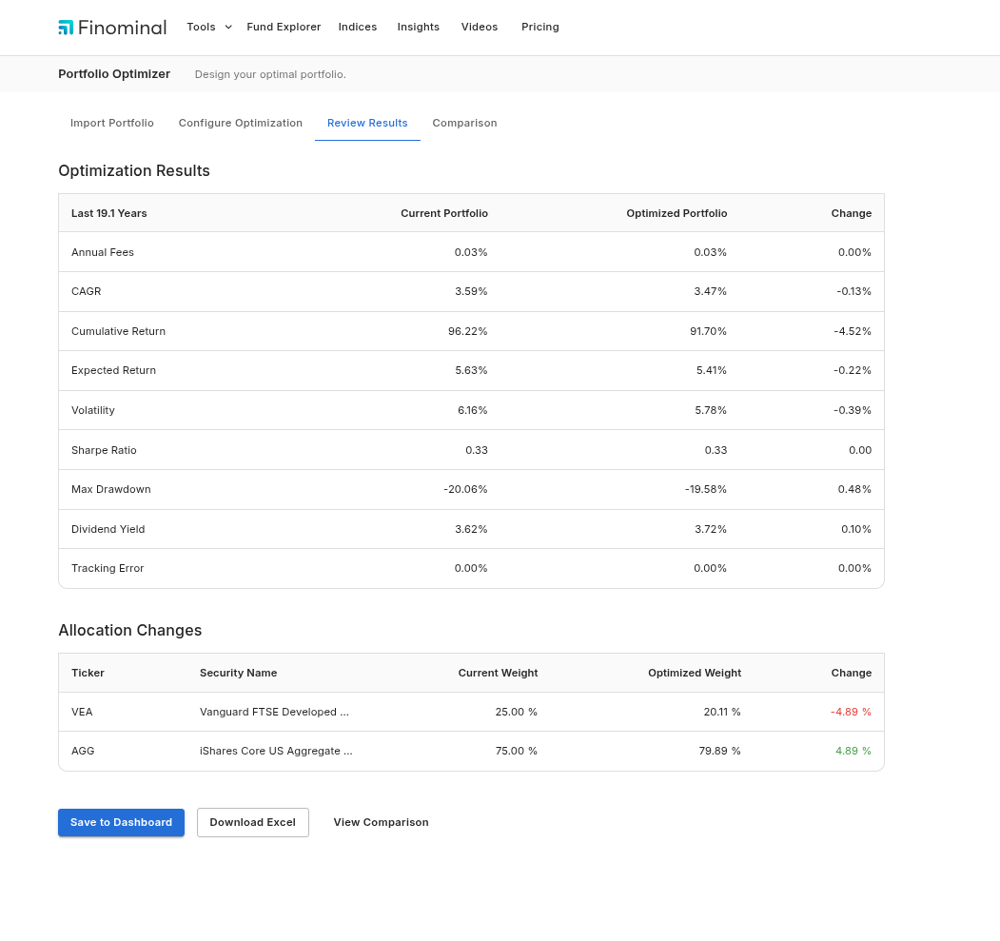
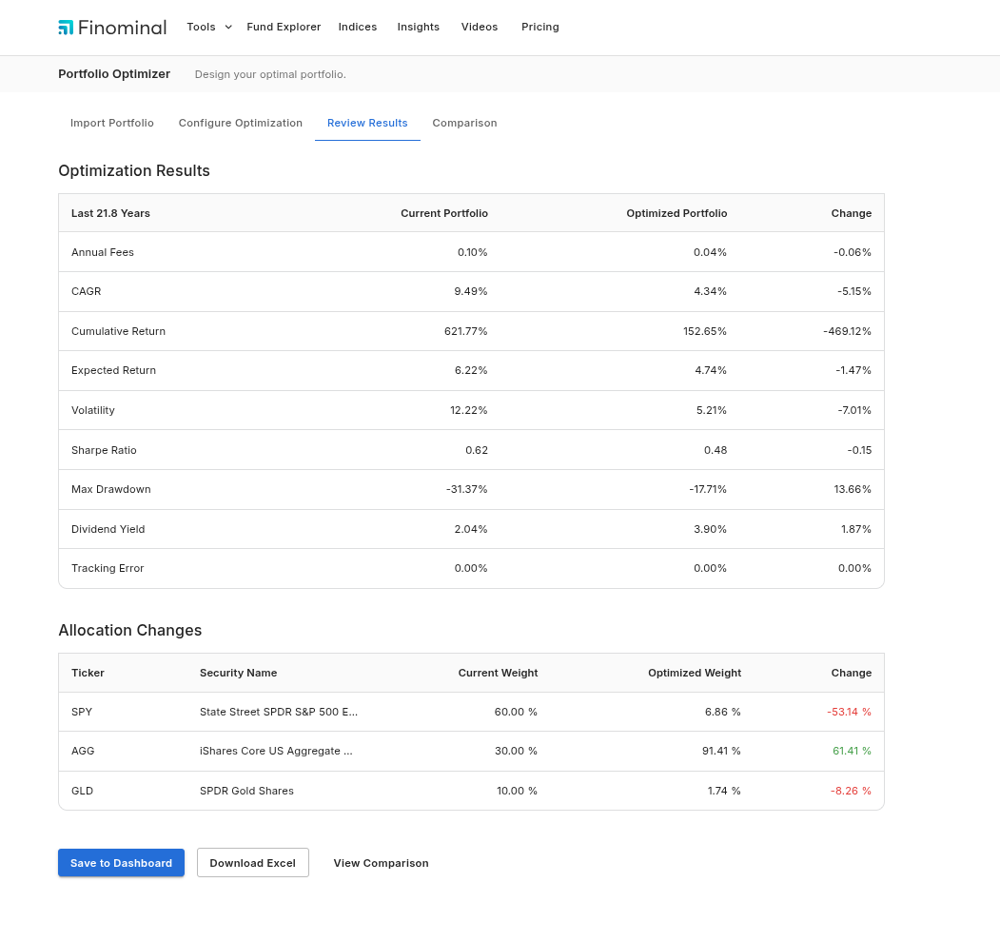
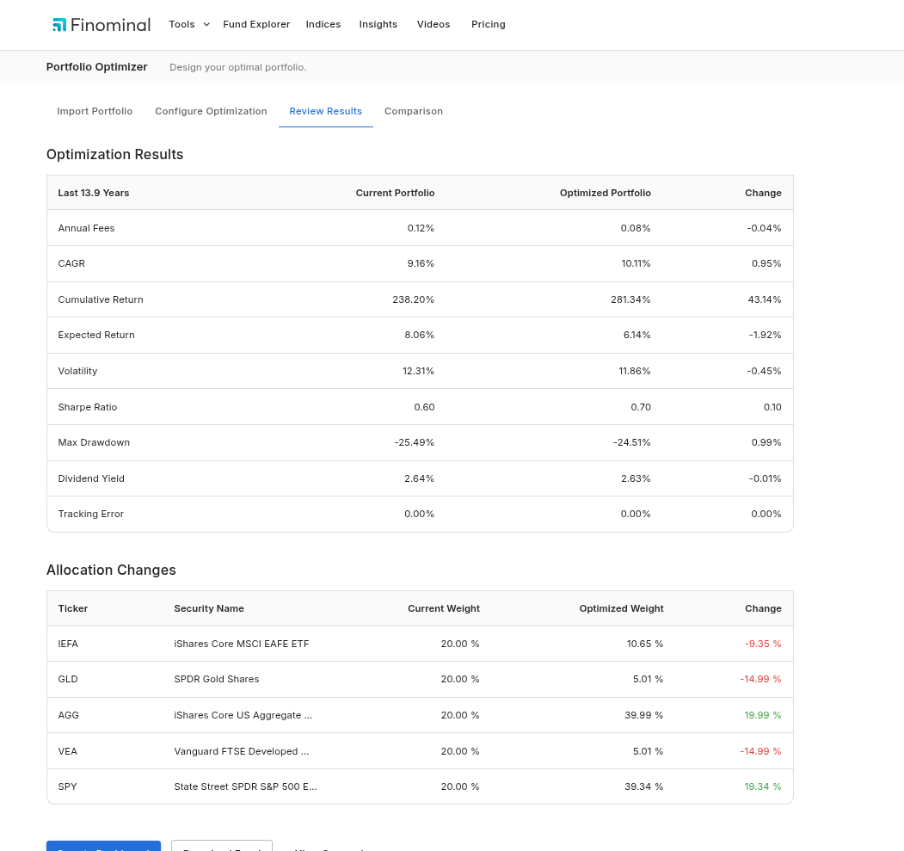
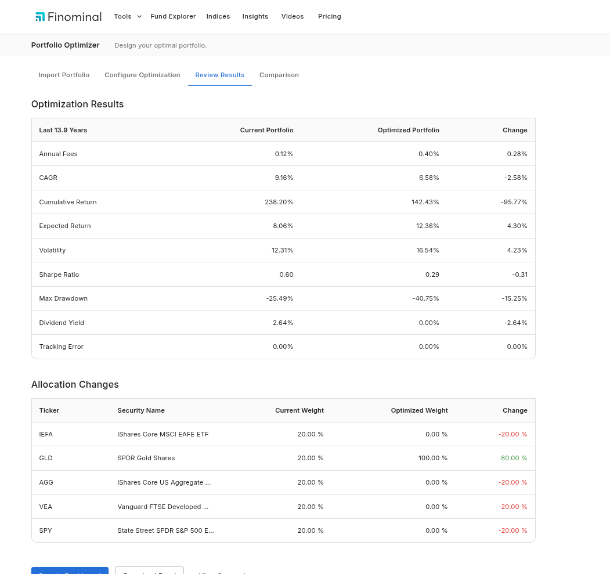

# Finominal Portfolio Optimizer API

This repository contains a FastAPI-based Portfolio Optimization engine replicating the core functionality of Finominal's live Portfolio Optimizer. It takes historical returns for 5 funds and a set of constraints, outputting optimized weights for 6 different strategies, as well as computing factor betas against Value, Momentum, and Size factors.

## Tech Stack
- **Framework**: FastAPI
- **Math/Optimization**: NumPy, SciPy (`scipy.optimize`), scikit-learn
- **Data**: Pandas (for parsing Excel and matrix math)
- **Environment**: `uv` (Fastest Python package manager)

## Setup Instructions

1. **Clone the repository**:
   ```bash
   git clone https://github.com/mustafaansarii/finominal-portfolio-optimizer
   cd finominal-backend-assignment
   ```

2. **Set up the virtual environment (using `uv`)**:
   ```bash
   # Create a virtual environment
   uv venv
   
   # Activate it (Linux/macOS)
   source .venv/bin/activate
   # Or on Windows:
   # .venv\Scripts\activate
   
   # Install dependencies
   uv pip install -r requirements.txt
   ```

3. **Ensure the data file exists**:
   Verify that `Data.xlsx` is present in the `data/` directory.

4. **Run the API**:
   ```bash
   uvicorn app.main:app --reload
   ```

   The API will be available at `http://127.0.0.1:8000`. You can also access the interactive Swagger UI at `http://127.0.0.1:8000/docs`.

## Testing the Application

You can test the application using `curl`:
```bash
curl -X 'POST' \
  'http://127.0.0.1:8000/optimize' \
  -H 'accept: application/json' \
  -H 'Content-Type: application/json' \
  -d '{
  "tickers": ["SPY", "AGG", "GLD"],
  "strategy": "minimize_volatility"
}'
```

## Structure
- `app/main.py`: FastAPI endpoints and error handling.
- `app/data_loader.py`: In-memory data management, parsing Excel into Pandas DataFrames.
- `app/schemas.py`: Pydantic models for strict JSON validation.
- `app/optimizer.py`: Core math engine using `scipy.optimize.minimize` to implement all 6 strategies, constraint rules, and scikit-learn for factor beta regressions.

## Built Strategies
1. `equal_weights`: Simple baseline.
2. `risk_parity`: Weights assets such that each contributes equally to total portfolio risk.
3. `minimize_drawdown`: Computes cumulative returns and minimizes the maximum historical peak-to-trough drop.
4. `minimize_volatility`: Minimizes overall standard deviation using the covariance matrix.
5. `maximize_sharpe_ratio`: Maximizes risk-adjusted returns (assuming a 0% risk-free rate).
6. `optimize_factor_exposure`: Performs a linear regression on historical returns against provided factor models, maximizing/minimizing the target beta.

## Constraints Handled
- Exact sum equal to 100%.
- Positive bounds ($w \ge 0$).
- Custom $min/max$ weight limits per security.
- Portfolio-level limit (e.g., Minimum aggregate dividend yield).

## Test Cases & Validation

### Case 1: Equal Weights
**API Request:**
```bash
curl -X 'POST' \
  'http://127.0.0.1:8000/optimize' \
  -H 'Content-Type: application/json' \
  -d '{"tickers": ["IEFA", "SPY"], "current_weights": {"IEFA": 0.25, "SPY": 0.75}, "strategy": "equal_weights"}'
```

**API Response:**
```json
{
  "optimization_strategy": "equal_weights",
  "allocation_changes": [
    {
      "ticker": "IEFA",
      "security_name": "iShares Core MSCI EAFE ETF",
      "current_weight": 25.0,
      "optimized_weight": 50.0,
      "change": 25.0
    },
    {
      "ticker": "SPY",
      "security_name": "State Street SPDR S&P 500 ETF Trust",
      "current_weight": 75.0,
      "optimized_weight": 50.0,
      "change": -25.0
    }
  ],
  "factor_betas": {
    "current_portfolio": {
      "value": 0.24,
      "momentum": 0.17,
      "size": -0.17
    },
    "optimized_portfolio": {
      "value": 0.28,
      "momentum": 0.17,
      "size": -0.13
    }
  }
}
```
**Finominal UI Validation:**
As expected, the live UI matches the API output perfectly (IEFA 50%, SPY 50%):


---

### Case 2: Risk Parity
**API Request:**
```bash
curl -X 'POST' \
  'http://127.0.0.1:8000/optimize' \
  -H 'Content-Type: application/json' \
  -d '{"tickers": ["VEA", "AGG"], "current_weights": {"VEA": 0.25, "AGG": 0.75}, "strategy": "risk_parity"}'
```

**API Response:**
```json
{
  "optimization_strategy": "risk_parity",
  "allocation_changes": [
    {
      "ticker": "VEA",
      "security_name": "Vanguard Developed Markets Index Fund;ETF",
      "current_weight": 25.0,
      "optimized_weight": 20.13,
      "change": -4.87
    },
    {
      "ticker": "AGG",
      "security_name": "iShares Core US Aggregate Bond ETF",
      "current_weight": 75.0,
      "optimized_weight": 79.87,
      "change": 4.87
    }
  ],
  "factor_betas": {
    "current_portfolio": {
      "value": 0.08,
      "momentum": 0.02,
      "size": -0.07
    },
    "optimized_portfolio": {
      "value": 0.06,
      "momentum": 0.02,
      "size": -0.07
    }
  }
}
```
**Finominal UI Validation:**
As expected, the live UI matches the API output perfectly (VEA ~20%, AGG ~80%):


---

### Case 3: Minimize Volatility
**API Request:**
```bash
curl -X 'POST' \
  'http://127.0.0.1:8000/optimize' \
  -H 'Content-Type: application/json' \
  -d '{"tickers": ["SPY", "AGG", "GLD"], "current_weights": {"SPY": 0.6, "AGG": 0.3, "GLD": 0.1}, "strategy": "minimize_volatility"}'
```

**API Response:**
```json
{
  "optimization_strategy": "minimize_volatility",
  "allocation_changes": [
    {
      "ticker": "SPY",
      "security_name": "State Street SPDR S&P 500 ETF Trust",
      "current_weight": 60.0,
      "optimized_weight": 6.92,
      "change": -53.08
    },
    {
      "ticker": "AGG",
      "security_name": "iShares Core US Aggregate Bond ETF",
      "current_weight": 30.0,
      "optimized_weight": 91.21,
      "change": 61.21
    },
    {
      "ticker": "GLD",
      "security_name": "SPDR Gold Shares",
      "current_weight": 10.0,
      "optimized_weight": 1.86,
      "change": -8.14
    }
  ],
  "factor_betas": {
    "current_portfolio": {
      "value": 0.16,
      "momentum": 0.06,
      "size": -0.15
    },
    "optimized_portfolio": {
      "value": -0.01,
      "momentum": 0.01,
      "size": -0.05
    }
  }
}
```
**Finominal UI Validation:**
As expected, the live UI matches the API output perfectly (SPY ~6.9%, AGG ~91.2%, GLD ~1.8%):


---

### Case 4: Maximize Sharpe Ratio (No constraints)
**API Request:**
```bash
curl -X 'POST' \
  'http://127.0.0.1:8000/optimize' \
  -H 'Content-Type: application/json' \
  -d '{"tickers": ["IEFA", "GLD", "AGG", "VEA", "SPY"], "current_weights": {"IEFA": 0.2, "GLD": 0.2, "AGG": 0.2, "VEA": 0.2, "SPY": 0.2}, "strategy": "maximize_sharpe_ratio"}'
```

**API Response:**
```json
{
  "optimization_strategy": "maximize_sharpe_ratio",
  "allocation_changes": [
    {
      "ticker": "IEFA",
      "security_name": "iShares Core MSCI EAFE ETF",
      "current_weight": 20.0,
      "optimized_weight": 0.0,
      "change": -20.0
    },
    {
      "ticker": "GLD",
      "security_name": "SPDR Gold Shares",
      "current_weight": 20.0,
      "optimized_weight": 20.08,
      "change": 0.08
    },
    {
      "ticker": "AGG",
      "security_name": "iShares Core US Aggregate Bond ETF",
      "current_weight": 20.0,
      "optimized_weight": 34.39,
      "change": 14.39
    },
    {
      "ticker": "VEA",
      "security_name": "Vanguard Developed Markets Index Fund;ETF",
      "current_weight": 20.0,
      "optimized_weight": 0.0,
      "change": -20.0
    },
    {
      "ticker": "SPY",
      "security_name": "State Street SPDR S&P 500 ETF Trust",
      "current_weight": 20.0,
      "optimized_weight": 45.53,
      "change": 25.53
    }
  ],
  "factor_betas": {
    "current_portfolio": {
      "value": 0.17,
      "momentum": 0.13,
      "size": -0.06
    },
    "optimized_portfolio": {
      "value": 0.07,
      "momentum": 0.1,
      "size": -0.09
    }
  }
}
```
**Finominal UI Validation:**
As expected, the live UI matches the API output perfectly (IEFA 0%, GLD ~20%, AGG ~34%, VEA 0%, SPY ~45%):


---

### Case 5: Maximize Sharpe Ratio (With Multi-Constraints)
**API Request:**
```bash
curl -X 'POST' \
  'http://127.0.0.1:8000/optimize' \
  -H 'Content-Type: application/json' \
  -d '{"tickers": ["IEFA", "GLD", "AGG", "VEA", "SPY"], "current_weights": {"IEFA": 0.2, "GLD": 0.2, "AGG": 0.2, "VEA": 0.2, "SPY": 0.2}, "strategy": "maximize_sharpe_ratio", "constraints": {"min_weight": 0.05, "max_weight": 0.4, "min_dividend_yield": 0.025}}'
```

**API Response:**
```json
{
  "optimization_strategy": "maximize_sharpe_ratio",
  "allocation_changes": [
    {
      "ticker": "IEFA",
      "security_name": "iShares Core MSCI EAFE ETF",
      "current_weight": 20.0,
      "optimized_weight": 14.68,
      "change": -5.32
    },
    {
      "ticker": "GLD",
      "security_name": "SPDR Gold Shares",
      "current_weight": 20.0,
      "optimized_weight": 7.14,
      "change": -12.86
    },
    {
      "ticker": "AGG",
      "security_name": "iShares Core US Aggregate Bond ETF",
      "current_weight": 20.0,
      "optimized_weight": 40.0,
      "change": 20.0
    },
    {
      "ticker": "VEA",
      "security_name": "Vanguard Developed Markets Index Fund;ETF",
      "current_weight": 20.0,
      "optimized_weight": 5.0,
      "change": -15.0
    },
    {
      "ticker": "SPY",
      "security_name": "State Street SPDR S&P 500 ETF Trust",
      "current_weight": 20.0,
      "optimized_weight": 33.18,
      "change": 13.18
    }
  ],
  "factor_betas": {
    "current_portfolio": {
      "value": 0.17,
      "momentum": 0.13,
      "size": -0.06
    },
    "optimized_portfolio": {
      "value": 0.12,
      "momentum": 0.1,
      "size": -0.08
    }
  }
}
```
**Finominal UI Validation:**
As expected, the live UI matches the API output perfectly (Strictly enforced 40% ceiling on AGG and 5% floor on VEA):


---

### Case 6: Maximize Momentum Exposure (Bonus)
**API Request:**
```bash
curl -X 'POST' \
  'http://127.0.0.1:8000/optimize' \
  -H 'Content-Type: application/json' \
  -d '{"tickers": ["IEFA", "GLD", "AGG", "VEA", "SPY"], "current_weights": {"IEFA": 0.2, "GLD": 0.2, "AGG": 0.2, "VEA": 0.2, "SPY": 0.2}, "strategy": "optimize_factor_exposure", "factor_to_optimize": "Momentum Factor", "maximize_factor": true}'
```

**API Response:**
```json
{
  "optimization_strategy": "optimize_factor_exposure",
  "allocation_changes": [
    {
      "ticker": "IEFA",
      "security_name": "iShares Core MSCI EAFE ETF",
      "current_weight": 20.0,
      "optimized_weight": 0.0,
      "change": -20.0
    },
    {
      "ticker": "GLD",
      "security_name": "SPDR Gold Shares",
      "current_weight": 20.0,
      "optimized_weight": 0.0,
      "change": -20.0
    },
    {
      "ticker": "AGG",
      "security_name": "iShares Core US Aggregate Bond ETF",
      "current_weight": 20.0,
      "optimized_weight": 0.0,
      "change": -20.0
    },
    {
      "ticker": "VEA",
      "security_name": "Vanguard Developed Markets Index Fund;ETF",
      "current_weight": 20.0,
      "optimized_weight": 100.0,
      "change": 80.0
    },
    {
      "ticker": "SPY",
      "security_name": "State Street SPDR S&P 500 ETF Trust",
      "current_weight": 20.0,
      "optimized_weight": 0.0,
      "change": -20.0
    }
  ],
  "factor_betas": {
    "current_portfolio": {
      "value": 0.17,
      "momentum": 0.13,
      "size": -0.06
    },
    "optimized_portfolio": {
      "value": 0.35,
      "momentum": 0.19,
      "size": -0.06
    }
  }
}
```
**Finominal UI Validation:**
As expected, the live UI matches the API output perfectly (Successfully maximizes momentum beta by pushing weight into VEA):


---

